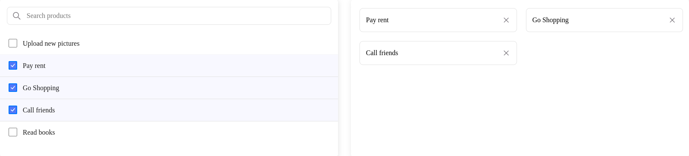

  

# React Multi Selection UI

  

<a  href="https://www.npmjs.com/package/@keyvaluesystems/react-multi-selection-ui-component"></a>  <a  href="https://www.npmjs.com/package/@keyvaluesystems/react-multi-selection-ui-component"  ></a>  <a  href="https://github.com/KeyValueSoftwareSystems/react-multi-selection-ui"></a>

  

<div  align="center">

</div>

  

>A customizable ready to use Multi Selection UI component with Search feature

  

Try tweaking a multi selection ui component using this codesandbox link <a  href="https://codesandbox.io/s/multi-selection-ui-gzcfrn">here</a>

  

## Installation

  

The easiest way to use react-multi-selection-ui-component is to install it from npm and build it into your app with Webpack.

  

```bash

npm install  @keyvaluesystems/react-multi-selection-ui-component

```

You’ll need to install React separately since it isn't included in the package.  

## Usage

React Multi Selection UI can run in a very basic mode by just providing the `options` like given below:

  

```jsx

import  MultiSelection  from  '@keyvaluesystems/react-multi-selection-ui-component';

<MultiSelection
  options={optionsArray}
/>

```

  

The optionsArray is an array of objects with the following keys:

  

-  `id` - a unique identifier for each option

-  `name` - a string that represents each option label

-  `checked` - an optional boolean value to indicate the default state

An example for options array is shown below:

  

```jsx
const  optionsArray = [
  {
    id:  1,
    name:  'Option 1',
    checked: true
  },
  {
    id:  2,
    name:  'Option 2',
  }
]
```
## v1.0.0 (Major Version Change)

This release includes breaking changes, new features, and updates. Please read this document carefully before upgrading

### Breaking Changes

- `productList` prop is renamed to `options` with an additional checked item in the object
- `zeroState` prop is deprecated
-  Major changes in the UI behavior

### Migration Steps

- `options` props can be used to pass the list
- `searchPlaceholder` is replaced with `placeholder`
- `renderEmptyItem` can be used to pass the empty state component
- `setSelectedValues` is replaced with `onItemClick`


## Props

  Props that can be passed to the component are listed below:

<table>
<thead>
<tr>
<th>Prop</th>
<th>Description</th>
<th>Default</th>
</tr>
</thead>
<tbody>
<tr>
<td><code><b>options:</b> object[]</code></td>
<td>
An array of objects to specify the id, name and default state of each option
</td>
<td><code>[]</code></td>
</tr>
<tr>
<td><code><b>showCheckbox?:</b> boolean</code></td>
<td>
The boolean value to control the display of checkbox in the selection list
</td>
<td><code>true</code></td>
</tr>
<tr>
<td><code><b>placeholder?:</b> string</code></td>
<td>
The placeholder value for the search text box if search is enabled and default text shown in the box if search is disabled
</td>
<td><code>'Choose an option'</code></td>
</tr>
<tr>
<td><code><b>hideSelected?:</b> boolean</code></td>
<td>
The boolean value to control the display of selected values in the list
</td>
<td><code>false</code></td>
</tr>
<tr>
<td><code><b>hideSearch?:</b> boolean</code></td>
<td>
The boolean value to control the display of search text box in the selection list
</td>
<td><code>false</code></td>
</tr>
<tr>
<td><code><b>onSearch?:</b> function</code></td>
<td>
The callback function which will be triggered on text change in the search box
</td>
<td><code>undefined</code></td>
</tr>
<tr>
<td><code><b>onItemClick?:</b> function</code></td>
<td>
The callback function which will be triggered on clicking the check box and chip's close button. Can be used for obtaining the selected values
</td>
<td><code>undefined</code></td>
</tr>
<tr>
<td><code><b>styles?:</b> object</code></td>
<td>
Provides you with a bunch of callback functions to override the default styles.
</td>
<td><code>undefined</code></td>
</tr>
<tr>
<td><code><b>showChips?:</b> boolean</code></td>
<td>
The boolean value to control the display of selected options as chips.
</td>
<td><code>true</code></td>
</tr>
<tr>
<td><code><b>maxHeight?:</b> string | number</code></td>
<td>
The prop to control the height of the dropdown modal.
</td>
<td><code>'100%'</code></td>
</tr>
<tr>
<td><code><b>renderEmptyItem?:</b> JSX</code></td>
<td>
The JSX element to be shown in case of empty result.
</td>
<td><code>No other options</code></td>
</tr>
<tr>
<td><code><b>isLoading?:</b> boolean</code></td>
<td>
The boolean value to show loading state in the dropdown list.
</td>
<td><code>false</code></td>
</tr>
<tr>
<td><code><b>renderLoader?:</b> JSX</code></td>
<td>
The JSX element to be shown while loading.
</td>
<td><code>Default loader component</code></td>
</tr>
<tr>
<td><code><b>hasError?:</b> boolean</code></td>
<td>
The boolean value to indicate error.
</td>
<td><code>false</code></td>
</tr>
<tr>
<td><code><b>helperText?:</b> ''</code></td>
<td>
To display an additional message.
</td>
<td><code>''</code></td>
</tr>
<tr>
<td><code><b>thresholdForBubble?:</b> number</code></td>
<td>
To limit the number of chips shown.
</td>
<td><code>length of options array</code></td>
</tr>
<tr>
<td><code><b>icons?:</b> object</code></td>
<td>
Provides you with an object to replace the default icons used.
</td>
<td><code>undefined</code></td>
</tr>
</tbody>
</table>

## Style Customizations


All the default styles provided by this package are overridable using the `style` prop.
the below code shows all the overridable styles:

```jsx
<MultiSelection
 options={optionsArray}
 styles={{
    Container?: () => ({...styles}),
    SearchComponent?: () => ({...styles}),
    SelectedMenuItem?: () => ({...styles}),
    UnSelectedMenuItem?: () => ({...styles}),
    ChipComponent?: () => ({...styles}),
    HelperText?: () => ({...styles}),
    InputBox?: () => ({...styles}),
    CheckedIcon?: () => ({...styles}),
    UnCheckedIcon?: () => ({...styles}),
    ChipCloseIcon?: () => ({...styles}),
    SearchIcon?: () => ({...styles}),
    ArrowIcon?: () => ({...styles}),
    HiddenChipsIndicator?: () => ({...styles})
 }}
/>
```
-  `Container` - overrides the multi selection ui container style
-  `SearchComponent` - overrides the search component styles
-  `SelectedMenuItem` - overrides the selected menu item styles
-  `UnSelectedMenuItem` - overrides the non selected item styles
-  `ChipComponent` - overrides the chip style
-  `HelperText` - overrides the helper text style
-  `InputBox` - override the style of the box containing the chips and search bar
-  `CheckedIcon` - overrides the checked icon style
-  `UnCheckedIcon` - overrides the unchecked box style
-  `ChipCloseIcon`- overrides the close icon style inside the chip
-  `SearchIcon` - overrides the search icon style
-  `ArrowIcon` - overrides the arrow icon style (right)
-  `HiddenChipsIndicator` - overrides the style of the bubble showing the number of hidden chips if thresholdForBubble prop has a value

## Icon Customizations


All the default icons provided by this package are overridable using the `icons` prop.
the below code shows all the overridable icons:

```jsx
<MultiSelection
 options={optionsArray}
 icons={{
    Search?: url,
    ChipClose?: url,
    Checked?: url,
    Arrow?: url
 }}
/>
```
-  `Search` - override the search icon
-  `ChipClose` - overrides the chip close icon 
-  `Checked` - override the checkbox checked icon
-  `Arrow` - override the down arrow(right)