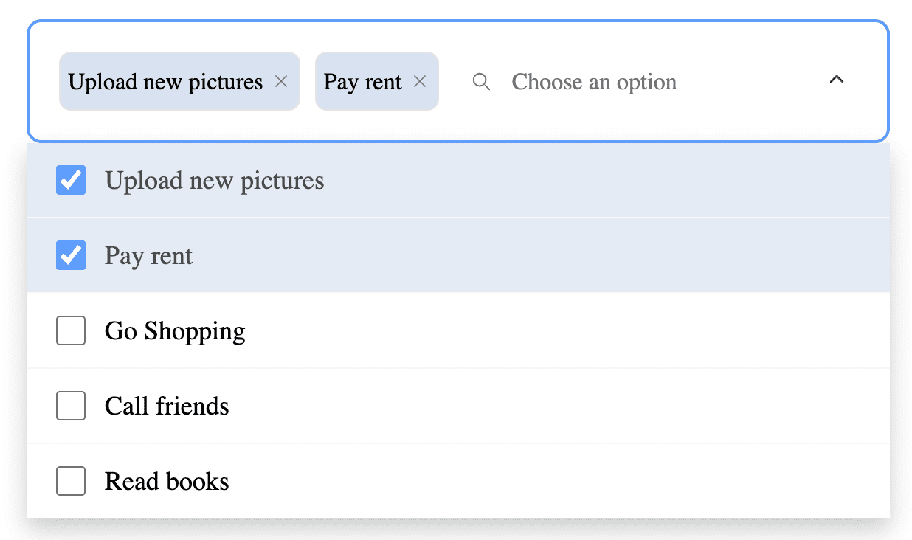

# React Multi Selection UI

<a  href="https://www.npmjs.com/package/@keyvaluesystems/react-multi-selection-ui-component"></a> <a  href="https://www.npmjs.com/package/@keyvaluesystems/react-multi-selection-ui-component"  ></a> <a  href="https://github.com/KeyValueSoftwareSystems/react-multi-selection-ui"></a>

<div  align="center">

</div>

> A pre-built, customizable Multi-Selection UI component with an integrated search feature

Try tweaking a multi selection ui component using this codesandbox link <a  href="https://codesandbox.io/s/react-multi-select-cy5x78?file=/src/App.js">here</a>

## Installation

The easiest way to use react-multi-selection-ui-component is to install it from npm and build it into your app with Webpack.

```bash

npm install  @keyvaluesystems/react-multi-selection-ui-component

```

You’ll need to install React separately since it isn't included in the package.

Note for **Next.js** users, if you are using Next.js version 13 or later, you will have to use the `use client` feature to ensure proper compatibility.

## Usage

React Multi Selection UI can run in a very basic mode by just providing the `options` like given below:

```jsx
import MultiSelection from "@keyvaluesystems/react-multi-selection-ui-component";

<MultiSelection options={optionsArray} />;
```

The optionsArray consists of objects with the following keys:

- `id`: A unique identifier for each option.
- `name`: A string representing the label for each option.
- `checked`: An optional boolean value indicating the default state of the option

An example for options array is shown below:

```jsx
const optionsArray = [
  {
    id: 1,
    name: "Option 1",
    checked: true,
  },
  {
    id: 2,
    name: "Option 2",
  },
];
```

## v1.0.0 (Major Version Change)

This release includes breaking changes, new features, and updates. Please read this document carefully before upgrading

### Breaking Changes

- The `productList` prop has been renamed to `options`, and now each object within the options array includes an additional optional `checked` property.
- The `zeroState` prop is deprecated.
- Significant alterations have been made to the UI behavior.
  Please take note of these changes during the upgrade

### Migration Steps

- Update Options Prop: The `productList` prop has been renamed to `options`. Use the `options` prop to pass the list of items.
- Replace `searchPlaceholder` with placeholder:The `searchPlaceholder` prop has been replaced with `placeholder`.
- Utilize `renderEmptyItem` Prop: To pass the empty state component, use the renderEmptyItem prop.

<b>Before</b>

```jsx
<MultiSelection
  productList={yourProductList}
  searchPlaceholder="Type to search..."
  zeroState={{
    selectionList: <YourCustomEmptyState />,
    selectedList: <YourCustomEmptyState />,
  }}
/>
```

<b>After</b>

```jsx
<MultiSelection
  options={yourProductList}
  placeholder="Type to search..."
  renderEmptyItem={<YourCustomEmptyState />}
/>
```

## Props

Props that can be passed to the component are listed below:

<table>
<thead>
<tr>
<th>Prop</th>
<th>Description</th>
<th>Default</th>
</tr>
</thead>
<tbody>
<tr>
<td><code><b>options:</b> object[]</code></td>
<td>
An array of objects to specify the id, name and default state of each option
</td>
<td><code>[]</code></td>
</tr>
<tr>
<td><code><b>showCheckbox?:</b> boolean</code></td>
<td>
The boolean value to control the display of checkbox in the selection list
</td>
<td><code>true</code></td>
</tr>
<tr>
<td><code><b>placeholder?:</b> string</code></td>
<td>
The placeholder value for the search text box if search is enabled and default text shown in the box if search is disabled
</td>
<td><code>'Choose an option'</code></td>
</tr>
<tr>
<td><code><b>hideSelected?:</b> boolean</code></td>
<td>
The boolean value to control the display of selected values in the list
</td>
<td><code>false</code></td>
</tr>
<tr>
<td><code><b>hideSearch?:</b> boolean</code></td>
<td>
The boolean value to control the display of search text box in the selection list
</td>
<td><code>false</code></td>
</tr>
<tr>
<td><code><b>onSearch?:</b> function</code></td>
<td>
The callback function which will be triggered on text change in the search box
</td>
<td><code>undefined</code></td>
</tr>
<tr>
<td><code><b>onItemClick?:</b> function</code></td>
<td>
The callback function which will be triggered on clicking the menu item row. Can be used for obtaining the clicked row id
</td>
<td><code>undefined</code></td>
</tr>
<tr>
<td><code><b>setSelectedValues?:</b> function</code></td>
<td>
The callback function which will be triggered on clicking the check box and chip's close button. Can be used for obtaining the selected id's
</td>
<td><code>undefined</code></td>
</tr>
<tr>
<td><code><b>styles?:</b> object</code></td>
<td>
Provides you with a bunch of callback functions to override the default styles.
</td>
<td><code>undefined</code></td>
</tr>
<tr>
<td><code><b>showChips?:</b> boolean</code></td>
<td>
The boolean value to control the display of selected options as chips.
</td>
<td><code>true</code></td>
</tr>
<tr>
<td><code><b>dropdownMaxHeight?:</b> string | number</code></td>
<td>
The prop to control the height of the dropdown modal.
</td>
<td><code>'100%'</code></td>
</tr>
<tr>
<td><code><b>renderEmptyItem?:</b> JSX</code></td>
<td>
The JSX element to be shown in case of empty result.
</td>
<td><code>No other options</code></td>
</tr>
<tr>
<td><code><b>isLoading?:</b> boolean</code></td>
<td>
The boolean value to show loading state in the dropdown list.
</td>
<td><code>false</code></td>
</tr>
<tr>
<td><code><b>renderLoader?:</b> JSX</code></td>
<td>
The JSX element to be shown while loading.
</td>
<td><code>Default loader component</code></td>
</tr>
<tr>
<td><code><b>hasError?:</b> boolean</code></td>
<td>
The boolean value to indicate error.
</td>
<td><code>false</code></td>
</tr>
<tr>
<td><code><b>helperText?:</b> ''</code></td>
<td>
To display an additional message.
</td>
<td><code>''</code></td>
</tr>
<tr>
<td><code><b>thresholdForBubble?:</b> number</code></td>
<td>
Show the bubble when the count of selected items reaches this threshold.
</td>
<td><code>length of options array</code></td>
</tr>
<tr>
<td><code><b>icons?:</b> object</code></td>
<td>
Provides you with an object to replace the default icons used.
</td>
<td><code>undefined</code></td>
</tr>
<tr>
<td><code><b>clearSearchClick?:</b> function</code></td>
<td>
The callback function which will be triggered on clicking close icon inside search box
</td>
<td><code>undefined</code></td>
</tr>
</tbody>
</table>

## Style Customizations

All the default styles provided by this package are overridable using the `style` prop.
the below code shows all the overridable styles:

```jsx
<MultiSelection
 options={optionsArray}
 styles={{
    Container?: {...styles},
    SearchComponent?: {...styles},
    HelperText?: {...styles},
    InputBox?: {...styles},
    CheckedIcon?: {...styles},
    UnCheckedIcon?: {...styles},
    ChipCloseIcon?: {...styles},
    SearchIcon?: {...styles},
    ArrowIcon?: {...styles},
    HiddenChipsIndicator?: {...styles},
    ClearSearchIcon?: {...styles},
    SelectedMenuItem?: (id) => ({...styles}),
    UnSelectedMenuItem?: (id) => ({...styles}),
    ChipComponent?: (id) => ({...styles}),
 }}
/>
```

To customize the style of various components, you can use the following prop names, each of which accepts a style object:

- `ArrowIcon`: Overrides the style of the right-arrow icon.
- `Container`: Overrides the style of the multi-selection UI container.
- `CheckedIcon`: Overrides the style of the checked icon.
- `ChipCloseIcon`: Overrides the style of the close icon within the chip.
- `ClearSearchIcon`: Overrides the style of the close icon within the search box.
- `HelperText`: Overrides the style of the helper text.
- `HiddenChipsIndicator`: Overrides the style of the bubble indicating the number of hidden chips if the thresholdForBubble prop has a value.
- `InputBox`: Overrides the style of the box containing the chips and search bar. Can be used to style the placeholder if the search is hidden.
- `SearchIcon`: Overrides the style of the search icon.
- `SearchComponent`: Overrides the styles of the search component.
- `UnCheckedIcon`: Overrides the style of the unchecked box.

You can utilize the provided prop names to customize the style of individual items in the chip or each item in the menu. This can be achieved by passing a function that returns the desired style for each element.

- `ChipComponent` - Overrides the chip style
- `SelectedMenuItem` - Overrides the selected menu item styles
- `UnSelectedMenuItem` - Overrides the non selected item styles

## Icon Customizations

The `icons` prop allows for the customization of default icons provided by this package
The following code displays the icons that can be customized

```jsx
<MultiSelection
 options={optionsArray}
 icons={{
    Search?: url || JSX.Element,
    ChipClose?: url || JSX.Element,
    Checked?: url || JSX.Element,
    Arrow?: url || JSX.Element,
    ClearSearch?: url || JSX.Element
 }}
/>
```

- `Arrow` - Overrides the down arrow(right)
- `ChipClose` - Overrides the chip close icon
- `Checked` - Overrides the checkbox checked icon
- `ClearSearch` - Overrides the close icon inside search box
- `Search` - Overrides the search icon
